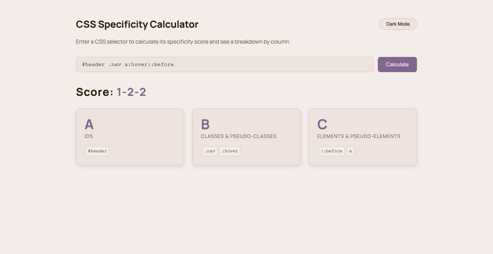
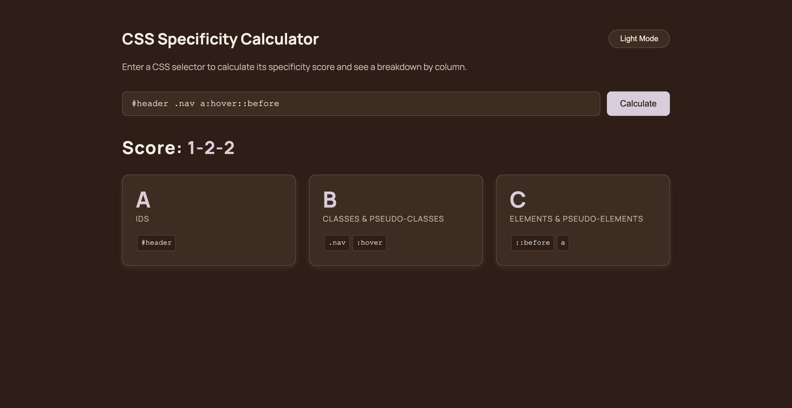

# CSS Specificity Calculator

A lightweight, accessible JavaScript tool that calculates CSS selector specificity scores and breaks down each contributor by column.

**[Live Demo](https://krisowens93.github.io/css-specificity-calculator/)**

---

## Features

- Calculates A-B-C specificity scores for any CSS selector
- Breaks down contributors per column — IDs, classes/pseudo-classes, and elements/pseudo-elements
- Light and dark mode with manual toggle
- Enter key support for faster workflow
- Input validation with clear error messaging
- Fully accessible — semantic HTML, ARIA labels, `aria-live` result announcements, and keyboard navigation
- Responsive layout across desktop, tablet, and mobile

---

## How Specificity Scoring Works

CSS specificity is scored across three independent columns:

| Column | What it counts | Example |
|--------|---------------|---------|
| **A** | ID selectors | `#header` |
| **B** | Classes, attributes, pseudo-classes | `.nav`, `[type="text"]`, `:hover` |
| **C** | Elements, pseudo-elements | `div`, `::before` |

Columns are compared left to right. A higher A column always wins regardless of B and C.

---

## Usage

1. Enter a CSS selector in the input field
2. Press **Calculate** or hit **Enter**
3. View the specificity score and per-column breakdown

---

## Built With

- Vanilla JavaScript (ES6+)
- CSS Custom Properties for theming
- Semantic HTML5
- No dependencies or build process required

---

## Accessibility

This project was built with accessibility as a first principle:

- `aria-live="polite"` on the result container announces score updates to screen readers
- All interactive elements have visible focus styles via `:focus-visible`
- Theme toggle button updates its `aria-label` dynamically to reflect the action it will perform
- Color contrast meets WCAG 2.1 AA standards in both light and dark modes
- Fully keyboard navigable

---

## License

MIT
